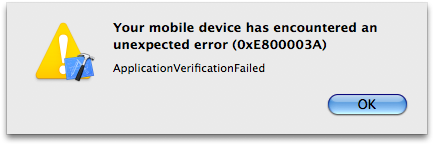

# 0xE800003A ApplicationVerificationFailed
Skrevet:  20. apr 2009

Har sjekket ut hvordan det er å programmere en iPhone app i det siste. Selve programmeringen er ikke så vanskelig men Apple kunne gjort litt mer for å gjøre selve testingen på en iPhone lettere. 

Apple har et system der du må lage sertifikater og legge de inn på iPhonen, dette er forsåvidt bra. Men du kommer sikkert kjapt til å komme over et problem, hvis du gjør som meg og leser manualen dårlig. I det du skal kjøre opp appen din på telefonen vil du sannsynligvis få denne bedskjeden:

Løsningen vil da være å putte:

<blockquote>com.domenenavnet.appnavnet</blockquote>

I stedet for

<blockquote>xxx.com.domenenavnet.appnavnet</blockquote>

inn i Info.plist -> Bundle identifier.