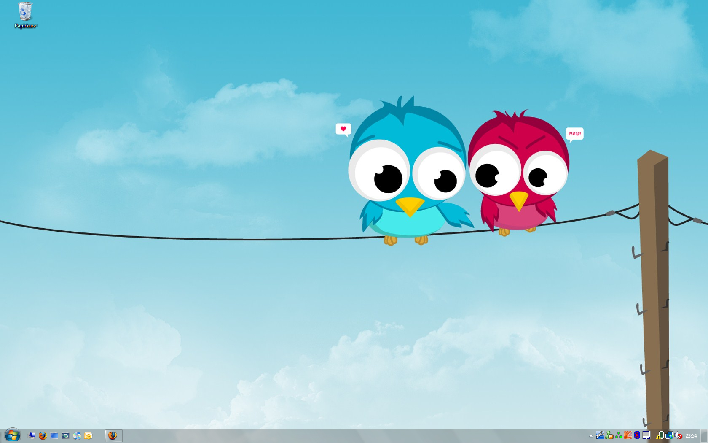

# Bring Windows 7 til Windows Vista
Skrevet: 14. nov 2008

Det er noen nye design fordeler i Microsoft sitt kommende operativsystem Windows 7. I dette innlegget vil jeg ta for meg noen nyttige tips for hvordan du kan ta i bruk noen av disse i Windows Vista.

## Windows 7 Tema
<ol>
	<li>Først må du patche uxtheme.dll og theme.ui.dll filene. Dette kan gjøres manuelt, men jeg anbefaler å bruke <a title="VistaGlazz" href="http://www.codegazer.com/vistaglazz/">VistaGlazz </a>som automatiserer hele denne prosessen.</li>
	<li>Deretter kan du gå inn på <a title="Vista Themes" href="http://www.myvistathemes.com/">Vista Themes</a> siden å finne ditt Windows 7 tema</li>
	<li>Legg temaet i C:\Windows\Resources\Themes mappen</li>
	<li>Gå til skriveborder, høyre klikk og velg tilpass</li>
	<li>Velg tema</li>
	<li>Det <a title="Windows 7 tema" href="http://giannisgx89.deviantart.com/art/Windows-7-Vista-Style-FINAL-102269037">temaet</a> som er mest lik Windows 7 krever at du bytter ut explorer.exe</li>
	<li>For å bytte ut explorer.exe må du sette deg selv til eier av den før den kan skiftes ut</li>
	<li>Det gjør du ved å høyreklikke på filen, velge egenskaper, velg sikkerhet, velg avansert, velg eier og sett deg som eier av filen</li>
	<li>Nå kan du bytte den ut med den som følger med i temaet</li>
</ol>

## Windows 7 Taskbar - For alle som er lei den unødvendige teksten
<ol>
	<li>Last ned dette programmet <a title="EnhanceMyVista" href="http://www.seriousbit.com/download.aspx?file=EnhanceMyVistaFreeSetup.exe">EnhanceMyVista</a></li>
	<li>Gå til Customization</li>
	<li>Velg Taskbar</li>
	<li>Huk av Iconize your Taskbar</li>
	<li>Lagre</li>
	<li>Gå inn på Tilpass ved skrivebordet</li>
	<li>Vindusfarge og -utseende</li>
	<li>Trykk på åpne egenskaper for klassisk utseende for flere fargealternativer</li>
	<li>Velg avansert</li>
	<li>Velg aktiv tittellinje elementet og sett størrelsen til 22</li>
	<li>Restart din PC og du har en fin og ryddig taskbar</li>
</ol>
Det finnes mange andre ting man kan gjøre for å få Windows Vista mer lik Windows 7. Denne siden her tar for seg alt sammen: <a title="MegaGuide" href="http://www.intowindows.com/mega-guide-transform-vista-into-windows-7/">Mega Guide</a>

Jeg har kun brukt det jeg har fortalt om ovenfor og min desktop ser ut sånn her:

Lykke til med din tweaking