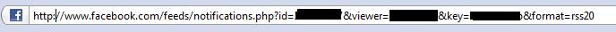

# Facebook RSS feed
Skrevet:  29. okt 2008

Har skrevet en plugin til wordpress for å skrive ut status oppdateringer en gjør på facebook. Poenget var at de som følger med på siden min skulle kunne vite sånn ca hva jeg gjorde til en hver tid, eller så ofte som jeg oppdaterer facebook statusen min.

For å få til dette måtte jeg gjøre noen google søk for å finne rss feed mulighetene på facebook. Det viser seg nemlig at det bare er fire mulige rss feeds på <a title="facebook feed" href="http://www.facebook.com/help.php?hq=subscribe">facebook</a>. Så derfor begynte jeg å se på notifications feeden. Men hvis man gjør enda litt research så finner man ut at en kan skifte ut notifications.php med status.php. Da vil du få opp en rss feed med bare status oppdateringer.

Notifications

Status

Uansett som du kan se på sidebaren min så fungerer pluginen helt fint. Skal se om jeg gjør den fin nok til å kunne legges ut. Hvis ikke så finner du sikkert en haug av andre rss feed plugins til wordpress.

