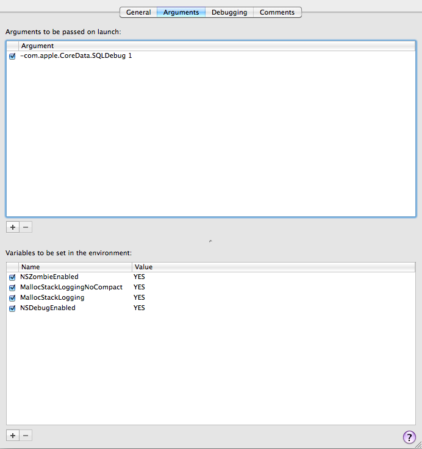

# Finne minnelekkasjer i Xcode
Skrevet: 16. sept 2010

I løpet av den siste tiden har jeg sporet opp minnelekkasjer i mine applikasjoner og jeg har endt opp med noen kjekke variabler.

Disse variablene må settes i Executables -&gt; ditt applikasjons navn -&gt; Get Info -&gt; Arguments tabben.

VIKTIG: Disse variablene MÅ være AV (huket av) når du sender inn applikasjonen til Apple.

NSZombieEnabled er helt klart den jeg har hatt mest brukt for. Den forhindrer at objekter blir deallokert, viser i konsollen om applikasjonen prøver å nå ett deallokert objekt og det blir lettere å finne problemet i kildekoden din.