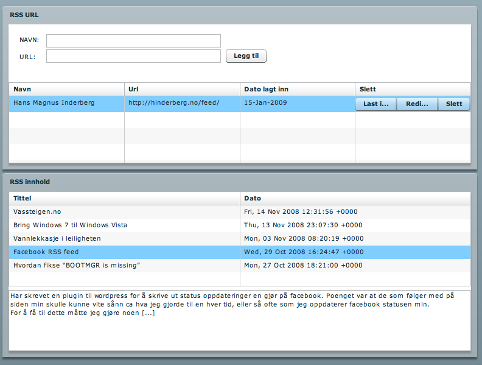

# Hovedprosjekt- Starte med flex
Skrevet:  18. jan 2009

Da var 2009 i gang og vi i har begynt med vårt hovedprosjekt (bachelor oppgave). Vi endte opp med et spennende prosjekt som er levert av Bekk Consulting. Prosjektet har fått navnet <a title="Google Code: AirDog" href="http://code.google.com/p/airdog/">AirDog</a>.

I hovedsak går dette prosjektet ut på å utvikle et rapportering og statistikk program mot data levert av <a title="Norsk Kennel Klubb" href="http://www.nkk.no/">Norsk Kennel Klubb(NKK).</a>

De to veilederne som vi har fått tildelt av Bekk heter Erlend og Ole. De er medlemmer av fuglehundklubbene Pointer og Breton, dermed vil programmet i hovedsak være rettet mot disse to klubbene i første omgang.

Vi skal bruke språkene flex og php. Vi har en del erfaring med php fra før, men flex blir noe helt nytt.

Etter litt utprøving endte jeg opp med dette:

FeedFlex heter det og man kan si at jeg bommet litt, men lærte mye. For å kunne abonnere på en feed med FeedFlex trenger man en crossdomain.xml i roten på det domenet feeden kommer ifra. Den trenger også å settes opp slik at en får tilgang utenifra.

Grunnen til at jeg ikke merket dette før programmet var "ferdig" var at i debug-mode så er ikke kravet om crossdomain.xml innført. Det var først da jeg sendte programmet til Tore (skolekamerat) at jeg merket at noe var feil. For dere som ønsker å få tilgang til filer og informasjon utenfor domenet som din flex app kjører så les mer om hvordan her: <a title="Hvordan lage crossdomain.xml" href="http://curtismorley.com/2007/09/01/flash-flex-tutorial-how-to-create-a-crossdomainxml-file/">Flash / Flex Tutorial - How to Create a crossdomain.xml file.</a>

Kildekoden på FeedFlex:

## FeedFlex.mxml

<pre><code class="lang">&lt;?xml version="1.0"?&gt;
&lt;mx:Application xmlns:mx="http://www.adobe.com/2006/mxml" initialize="initData()" width="100%" height="100%"&gt;
&lt;/mx&gt;&lt;mx :Script&gt;
&lt; ![CDATA[
import mx.rpc.events.FaultEvent;
import mx.formatters.DateFormatter;
import mx.resources.ResourceBundle;
import mx.collections.*;
import mx.controls.*;
import mx.events.*;

[Bindable]
public var localFeeds:ArrayCollection = new ArrayCollection();
public var lsofeeds:LSOHandler;

public function initData():void {
  lsofeeds = new LSOHandler("feeds");

  if (lsofeeds.getObjects()) {
    localFeeds = lsofeeds.getObjects();
  }
}

private function addFeed():void {
  var df:DateFormatter = new DateFormatter();
  df.formatString="DD-MMM-YYYY";

  var o:Object = {name:addAName.text, url:addAurl.text, date:df.format(new Date())};
  lsofeeds.addObject(o);

  localFeeds = lsofeeds.getObjects();

  addAName.text = "";
  addAurl.text = "";
}

private function removeFeed(eventObj:CloseEvent):void {
  if (eventObj.detail==Alert.OK) {
    if (myGrid.selectedIndex &gt; -1) {
      localFeeds.removeItemAt(myGrid.selectedIndex);
    }
  }
}

public function clickHandler(event:ItemClickEvent):void {
  if (event.index == 0){
    httpRSS.url = myGrid.selectedItem.url;
    httpRSS.send();
  }
  else if (event.index == 1) {
    myGrid.editable = true;
  }
  else {
    var objAlert:Alert = Alert.show(
    "Vil du slette " + myGrid.selectedItem.url, "Slette?",
    Alert.OK | Alert.CANCEL, this, removeFeed, null, Alert.OK);
  }
}

private function feedFaultHandler(event:FaultEvent):void {
  Alert.show("Problem med å laste inn feeden\n" +
  "Problemet kan komme av at det ikke er en feed url som er skrevet inn.",
  "Feed problem");
}

]]&gt;
&lt;/mx&gt;

&lt;mx :HTTPService id="httpRSS" resultFormat="object" fault="feedFaultHandler(event);" /&gt;

&lt;mx :VBox id="theBox" height="100%" width="80%" horizontalAlign="center"&gt;
&lt;/mx&gt;&lt;mx :Panel id="adder" title="RSS URL" width="100%"&gt;
&lt;/mx&gt;&lt;mx :Form width="100%"&gt;
&lt;/mx&gt;&lt;mx :Canvas height="57"&gt;
&lt;mx :Label  id="labelUrl" text="URL:" x="0" y="29"/&gt;
&lt;mx :Label  id="labelNavn" text="NAVN:" x="0" y="1"/&gt;
&lt;mx :TextInput id="addAName" width="287" borderStyle="solid" x="46" y="0"/&gt;
&lt;mx :TextInput id="addAurl" width="287" borderStyle="solid" x="46" y="25"/&gt;
&lt;mx :Button label="Legg til" click="addFeed()" x="341" y="25"/&gt;
&lt;/mx&gt;

&lt;mx :DataGrid id="myGrid" width="100%" height="133" dataProvider="{localFeeds}"&gt;
&lt;/mx&gt;&lt;mx :columns&gt;
&lt;mx :DataGridColumn headerText="Navn" dataField="name" /&gt;
&lt;mx :DataGridColumn headerText="Url" dataField="url" /&gt;
&lt;mx :DataGridColumn headerText="Dato lagt inn" dataField="date" /&gt;
&lt;/mx&gt;&lt;mx :DataGridColumn headerText="Slett" editable="false"&gt;
&lt;/mx&gt;&lt;mx :itemRenderer&gt;
&lt;/mx&gt;&lt;mx :Component&gt;
&lt;/mx&gt;&lt;mx :ButtonBar itemClick="outerDocument.clickHandler(event)"&gt;
&lt;/mx&gt;&lt;mx :dataProvider&gt;
&lt;/mx&gt;&lt;mx :Array&gt;
&lt;/mx&gt;&lt;mx :String&gt;Last inn&lt;/mx&gt;
&lt;mx :String&gt;Rediger&lt;/mx&gt;
&lt;mx :String&gt;Slett&lt;/mx&gt;

&lt;mx :Panel id="reader" title="RSS innhold" width="100%"&gt;
&lt;/mx&gt;&lt;mx :DataGrid id="entries" width="100%" dataProvider="{httpRSS.lastResult.rss.channel.item}" itemClick="{body.htmlText=httpRSS.lastResult.rss.channel.item[entries.selectedIndex].description}"&gt;
&lt;/mx&gt;&lt;mx :columns&gt;
&lt;mx :DataGridColumn dataField="title" headerText="Tittel" /&gt;
&lt;mx :DataGridColumn dataField="pubDate" headerText="Dato" /&gt;
&lt;/mx&gt;

&lt;mx :TextArea id="body" editable="false" width="100%" height="100"/&gt;

</code></pre>
## LSOHandler.as
<pre><code class="lang">// ActionScript file
package {
import mx.collections.ArrayCollection;
import flash.net.SharedObject;

public class LSOHandler {

  private var mySO:SharedObject;
  private var ac:ArrayCollection;
  private var lsoType:String;

  public function LSOHandler(s:String) {
    init(s);
  }

  private function init(s:String):void {
    ac = new ArrayCollection();
    lsoType = s;
    mySO = SharedObject.getLocal(lsoType);
    if (getObjects()) {
      ac = getObjects();
    }
  }

  public function getObjects():ArrayCollection {
    return mySO.data[lsoType];
  }

  public function addObject(o:Object):void {
    ac.addItem(o);
    updateSharedObjects();
  }

  private function updateSharedObjects():void {
    mySO.data[lsoType] = ac;
    mySO.flush();
  }
}
}
</code></pre>
Brukte <a title="LiveDocs" href="http://livedocs.adobe.com/flex/3/">Adobe - Flex 3 LiveDocs</a> for å finne det meste av informasjon man trenger for å komme i gang.

Det hjalp spesielt til å forstå SharedObject, som er Flex sin form for cookie. For å få mer informasjon om hvordan du bruker det kan du sjekke ut denne linken: <a title="Adobe Livedocs" href="http://livedocs.adobe.com/flex/3/html/help.html?content=lsos_3.html">http://livedocs.adobe.com/flex/3/html/help.html?content=lsos_3.html</a>

Sjekk ut vår prosjekt side <a title="Prosjektside" href="http://prosjekt.mindre.net">http://prosjekt.mindre.net</a>