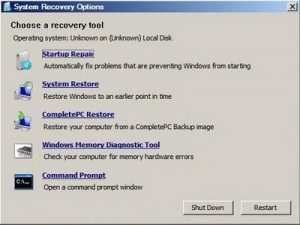

# Hvordan fikse "BOOTMGR is missing"
Skrevet: 27. okt 2008

For ikke så lenge siden kom jeg ovenfor et problem ved oppstart av den ene pc'n min. Jeg fikk denne beskjeden: "BOOTMGR is missing, Press Ctrl+Alt+Del to restart". Vell.. For dere andre som får denne beskjeden, det er heldigvis lettere å fikse enn du skulle tro.

## Først prøver du denne løsningen

1. Sett inn din Vista DVD
2. Restart datamaskinen din
3. Boot fra DVD'n
4. Vista spør deg om språk og tastatur layout
5. Så blir du spurt om du vil re-installere Vista eller om du vil reparere din eksiterende installasjon
6. Velg reparer
7. Du vil da få opp "System Recovery Options"
8. Velg deretter "Startup Repair".
9. Vista vil da prøve å reparere feilen.

Hvis dette skulle feile er det heldigvis en løsning nr. 2 som var den som funket for min del.

<h2>Andre løsning er</h2>

1. Gjør nummer 1-7 i første løsning
2. Trykk på "Command Prompt"
3. Skriv inn <strong>bootrec /rebuildbcd</strong>
4. Trykk<strong> ENTER</strong>
5. Hvis dette går som det skal blir du presentert med Vista sin installasjons mappe.
6. Da skriver du <strong>Yes</strong>
7. Men punkt nummer 5-6 kan også feile. Men ikke fortvil, alle gode ting er 3;)

<h2>Tredje løsning</h2>
Hvis du får beskjeden om at Bootrec ikke finner noen Windows installasjon må du gjøre følgende

1. Hvis du har gått ut av "Command Promt" går du inn igjen der og skriver følgende kommando
2. <strong>bcdedit /export C:\BCD_Backup</strong>
3. <strong>ren c:\boot\bcd bcd.old</strong>
4. strong>bootrec /rebuildbcd</strong>
5. Restart datamaskinen din og problemet skal være løst

Håper dette hjalp og lykke til.