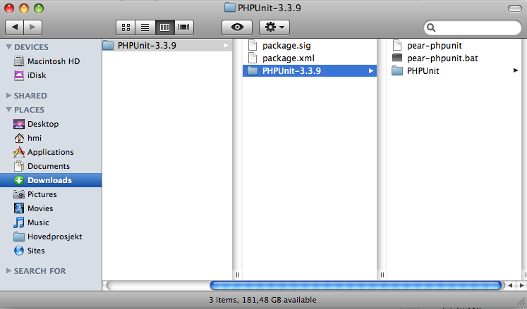
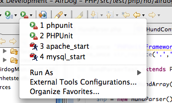
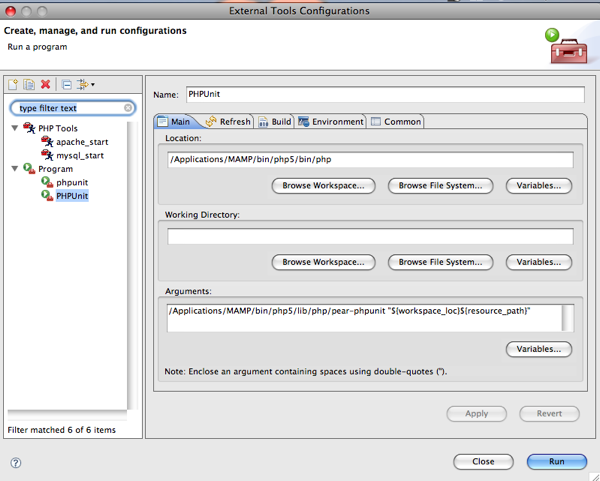

#Installere PHPUnit med MAMP og Eclipse
Skrevet: 2. feb 2009

Hadde en liten case her om dagen med å installere PHPUnit til Eclipse. Googlet det en del, men fant ingen gode eksempler.

Uansett her er hvordan du gjør det:

1. Gå til denne adressen <a title="PHPUnit" href="http://pear.phpunit.de/get/">http://pear.phpunit.de/get/</a>
2. Der skal du laste ned nyeste versjon av PHPUnit. For meg var det PHPUnit-3.3.9.tgz
3. Pakk ut så vil mappe strukturen din se omtrent slik ut:

4. Plasser PHPUnit mappen og pear-phpunit filen i: /Applications/MAMP/bin/php5/lib/php/
5. Åpne pear-phpunit i din favoritt editor og bytt ut alle @php_bin@ med /Applications/MAMP/bin/php5/bin/php
6. Så åpner du PHPUnit/Util/Fileloader.php å bytter ut @php_bin@ med /Applications/MAMP/bin/php5/bin/php
7. Gå så inn i eclipse å åpne External Tools Configuration

8. Lag en ny konfigurasjon som ser slik ut:

9. Til sist må du redigere php.ini filen som ligger i /Applications/MAMP/conf/php5
10. include_path må inneholde stien til ditt prosjektet i eclipse, for eksempel slik:
11. include_path = ".:/Applications/MAMP/bin/php5/lib/php:/Users/Geir/Documents/Utvikling/Prosjekt-PHP/src/main/php"
12. Gå inn i eclipse, klikk en gang i vinduet med testene og kjør External Tools configen du lagde

Lykke til!