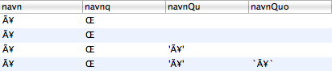

# Zend PHP og æøå problemer
Skrevet: 2. mar 2009

Kjapp løsning på at Zend DB ikke håndterer æ,ø og å (special characters) riktig.

<ol>
	<li>Første kolonne (navn) er en insert setning der bokstaven (å) har kommet over zend amf</li>
	<li>Andre kolonne (navnq) er en insert setning der bokstaven (å) er skrevet som en streng</li>
	<li>Tredje kolonne (navnQu) er en insert setning der bokstaven (å) har kommet over zend amf og det er brukt quoteInto</li>
	<li>Fjerde kolonne (navnQuo) er en insert setning der bokstaven (å) har kommet over zend amf og det er brukt quoteIdentifier.</li>
</ol>
Verken &amp;#229; eller &amp;aring; fungerer.

Løsningen er å gjøre en query til database objektet: $database-&gt;query('SET NAMES UTF8');

Eksempel:
<pre><code class="php">$database = Zend_Db::factory('Mysqli',array(
'host' =&gt; $this-&gt;dbServer,
'dbname' =&gt; $this-&gt;dbNavn,
'username' =&gt; $this-&gt;dbBrukernavn,
'password' =&gt; $this-&gt;dbPassord));
$database-&gt;query('SET NAMES UTF8');
</code></pre>

